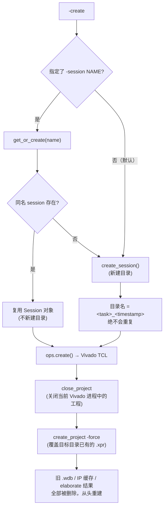

# Vivado Orchestrator

Python 驱动的 Vivado 自动化系统，替代 `vivado_do.tcl`。支持**会话隔离并行**、**分层哈希增量刷新**、**批处理模式**、**IP 仿真模型自动注入**。

## 架构

```
vivado_core/
├── session.py    会话管理 + Semaphore 并发门控
├── operations.py 高层操作 (create/refresh/sim/bitstream/program/archive) + prj 自动修补
├── batch.py      批处理执行 (ThreadPoolExecutor + 进度追踪 + 失败策略)
├── sync.py       预检 + 增量/全量刷新规划
├── hash.py       分层哈希 (rtl/tb/src/coe/fpga)
├── tasks.py      任务配置 (tasks.yaml)
├── config.py     全局配置 + 内存/Cache/DDR3/ClkWiz/RtlPaths 配置
├── ip_gen.py     BRAM/MIG/ClkWiz create_ip TCL 生成 + get_bram_ip_names()
├── cache_header_gen.py  cache_def.svh 自动生成
├── exceptions.py 异常层次
└── tcl/          TCL 模板 (仿真/综合/刷新/ILA/波形)

vivado_cli.py     CLI 前端 (含批处理)
vivado_tui.py     TUI 前端
```

## 核心命令

所有命令通过 CLI 执行：

```bash
python -m tools.vivado_cli <args>
```

### 会话管理

```bash
# 查看所有会话状态 + 增量刷新过时信息
python -m tools.vivado_cli --status

# 保留 (max_sessions - 1) 个最近使用的会话，仅清理最老的，腾出一个创建新会话的空间
# 不会清空全部空闲会话！如果批量运行(batch)后产生大量旧会话，需要用 --cleanup-all
python -m tools.vivado_cli --cleanup

# 彻底清理全部会话（包括空闲、报错的会话）
python -m tools.vivado_cli --cleanup-all

# 重新生成 cache_def.svh（修改 vivado_config.yaml 后）
python -m tools.vivado_cli --gen-config
```

### `-create` 标志行为（⚠ 注意）

`-create` 在会话层和工程层的行为不同：

**会话层**（`SessionManager.get_or_create()`）：
- 仅当同时指定 `-session NAME` 且同名 session 已存在 → 返回已有 Session 对象（不新建目录）
- 未给 `-session` 时（默认行为），永远创建新 session，名字为 `<task>_<timestamp>`，不可能覆盖

**工程层**（`Operations.create()` → `_tcl_create_project()` TCL）：
- Vivado TCL 执行 `close_project`（关闭当前 Vivado 进程中的工程）+ `create_project -force`（强制覆盖目标目录已有工程）
- **覆盖会导致**：旧的 `.wdb` 波形数据、IP 编译缓存、elaborate 结果被删除，从头重建
- 同名 session 重复 `-create` 的代价是工程被完全覆盖重来（秒级→分钟级耗时增加）

**Mermaid 流程图**：



**推荐做法**：
- 首次运行：`-create -sim`（新建 session + 新建工程 + 仿真）
- 改 RTL 后：`-refresh -sim`（更新已有工程 + 仿真，不改 project 目录）
- 只有在工程已损坏时才重复 `-create`（工程重建）
- 需要保留波形时用 `-session` 指定不同名字

### 仿真

```bash
# 首次：创建会话 + 仿真
python -m tools.vivado_cli -task cpu_full -create -sim

# 复用已有会话仿真
python -m tools.vivado_cli -task cpu_full -sim

# 覆盖仿真时间
python -m tools.vivado_cli -task cpu_full -sim -runtime 10ms

# 自定义会话名（同 task 多会话并行）
python -m tools.vivado_cli -task cpu_full -session cpu_v2 -sim

# 启用调试功能（详见 vivado-sim-debug 技能）
python -m tools.vivado_cli -task isa_alu -sim --debug trace        # 指令追踪
python -m tools.vivado_cli -task isa_alu -sim --debug pipeline     # 流水线转储
python -m tools.vivado_cli -task isa_alu -sim --debug trap         # 异常追踪
python -m tools.vivado_cli -task isa_alu -sim --debug spike        # Spike ISA 对比
python -m tools.vivado_cli -task isa_alu -sim --debug trace,trap   # 组合多个调试功能
python -m tools.vivado_cli -task isa_alu -sim --debug wave         # 波形（默认 normal 级别）
python -m tools.vivado_cli -task isa_alu -sim --debug wave:minimal # 最小波形
python -m tools.vivado_cli -task isa_alu -sim --debug wave:normal  # 普通波形
python -m tools.vivado_cli -task isa_alu -sim --debug wave:full    # 全信号波形 + VCD
python -m tools.vivado_cli -task isa_alu -sim --debug all          # 全部调试（等同 trace,pipeline,trap,spike,wave:full）
```

### 刷新

```bash
# 全量刷新（RTL 变更后）
python -m tools.vivado_cli -task cpu_full -refresh

# 增量刷新：仅 COE（改了程序后）
python -m tools.vivado_cli -task cpu_full -refresh --layers coe

# 增量刷新：仅 TB（改了 testbench 后）
python -m tools.vivado_cli -task cpu_full -refresh --layers tb

# 增量刷新：多层
python -m tools.vivado_cli -task cpu_full -refresh --layers coe,tb
```

### 综合/下载

```bash
# 生成 bitstream
python -m tools.vivado_cli -task fpga -bitstream

# 下载到 FPGA
python -m tools.vivado_cli -task fpga -program

# 导出工程归档
python -m tools.vivado_cli -task cpu_full -archive
```

## 可用任务

| 任务 | Testbench | 说明 |
|------|-----------|------|
| `cpu_full` | tb_simple_cpu_top | CPU 全功能测试 (5ms) |
| `cpu_compute` | tb_simple_cpu_compute | CPU 计算/访存测试 (5ms) |
| `cpu_trap` | tb_simple_cpu_trap | CPU 异常/陷阱测试 (3ms) |
| `cpu_fencei` | tb_cpu_test_fencei | fence.i JIT 测试 (5ms) |
| `cpu_access_fault` | tb_cpu_test_access_fault | 访问错误异常 (3ms) |
| `cpu_priv` | tb_simple_cpu_priv | 特权级测试 (20ms) |
| `isa_alu` | tb_isa_alu | ISA ALU 测试 (5ms) |
| `isa_branch` | tb_isa_branch | ISA 分支测试 (5ms) |
| `isa_memory` | tb_isa_memory | ISA 访存测试 (5ms) |
| `isa_upper_imm` | tb_isa_upper_imm | ISA 上立即数测试 (5ms) |
| `isa_jump` | tb_isa_jump | ISA 跳转测试 (5ms) |
| `isa_csr` | tb_isa_csr | ISA CSR 测试 (5ms) |
| `isa_m_ext` | tb_isa_m_ext | ISA 乘除扩展测试 (5ms) |
| `isa_f_ext` | tb_isa_f_ext | ISA 浮点扩展测试 (10ms) |
| `isa_f_ext_special` | tb_isa_f_ext_special | ISA 浮点特殊值测试 (10ms) |
| `exception_*` | (6 个) | 异常测试 (5-10ms) |
| `privilege_*` | (3 个) | 特权级测试 (10-20ms) |
| `mmu_*` | (11 个) | MMU/TLB 测试 (20-60ms) |
| `cache_*` | (5 个) | Cache 测试 (5-20ms) |
| `mmio_*` | (2 个) | MMIO 测试 (5-10ms) |
| `reg_*` | (7 个) | 回归测试 (10-20ms) |
| `fpu_adder` | tb_fpu_adder | FPU 加法器 (10us) |
| `fpu_multiplier` | tb_fpu_multiplier | FPU 乘法器 (10us) |
| `fpu_divider` | tb_fpu_divider | FPU 除法器 (50us) |
| `fpu_sqrt` | tb_fpu_sqrt | FPU 开方 (50us) |
| `fpu_cvt` | tb_fpu_cvt | FPU 转换 (10us) |
| `fpu_unit` | tb_fpu_unit | FPU 单元集成 (50us) |
| `uart_hello` | tb_uart_hello | UART 发送测试 (40ms) |
| `uart_echo` | tb_uart_echo | UART 回显测试 (100ms) |
| `led_marquee` | tb_led_marquee | LED 走马灯 (2s) |
| `calculator` | tb_calculator | 计算器应用 (100ms) |
| `ahb_bus` | tb_ahb_bus | AHB 总线测试 (5000ns) |
| `apb_perips` | tb_apb_perips | APB 外设测试 (2000ns) |
| `alu_integration` | tb_alu_cpu_integration | ALU 集成测试 (5000ns) |
| `mu_unit` | tb_mu_unit | 乘除法器测试 (5000ns) |
| `divider` | tb_non_restoring_divider | 除法器测试 (5000ns) |
| `fpga` | — | FPGA bitstream (top: system_top) |
| `ddr3_mig_ex` | tb_ddr3_mig_ex | MIG DDR3 控制器测试 (1000us) |
| `ddr3_ahb_ex` | tb_ddr3_ahb_ex | AHB+DDR3 测试 (1000us) |
| `ddr3_basic` | tb_ddr3_basic | DDR3 基础测试 (1000us) |
| `ddr3_system` | tb_ddr3_system | 全系统 DDR3 测试 (100ms) |
| `ddr3_system_v2` | tb_ddr3_system_v2 | DDR3 系统 v2 (100ms) |
| `ddr3_system_v3` | tb_ddr3_system_v3 | DDR3 系统 v3 (100ms) |

> 通配符速查：`isa_*`(9), `exception_*`(6), `privilege_*`(3), `mmu_*`(11), `cache_*`(5), `mmio_*`(2), `reg_*`(7), `fpu_*`(6), `cpu_*`(5), `ddr3_*`(7)

### 任务字段（tasks.yaml）

| 字段 | 类型 | 默认 | 说明 |
|------|------|------|------|
| `name` | str | (key) | 任务标识符（YAML 键名） |
| `tb` | str | `""` | Testbench 模块名 |
| `blcoe` | str | `""` | Bootloader COE 文件，用于 FPGA bitstream 生成和 DDR3 仿真。初始化 BRAM IP。与 `blhex` 互斥。 |
| `blhex` | str | `""` | Bootloader HEX 文件，用于 SRAM 模式仿真。bootROM 通过 `$readmemh("bootloader.hex")` 加载。与 `blcoe` 互斥。 |
| `phex` | str | `""` | 程序 HEX 文件，用于 SRAM 模式仿真。SRAM 通过 `$readmemh("prog.hex")` 加载。 |
| `runtime` | str | `""` | 仿真时间字符串 |
| `top` | str | `""` | 顶层模块名（bitstream 用） |
| `sim_mode` | str | `""` | 仿真模式标记（如 `"ddr3"`） |
| `verilog_defines` | dict | `{}` | Verilog defines（仿真时注入） |
| `mig_param_overrides` | dict | `{}` | MIG 参数覆盖（传递给 xelab 的 `-g` 标志） |

## IP 仿真策略（参照 chiplab）

### 核心问题

Xilinx IP（BRAM、MIG、ClkWiz）由 `create_ip` 生成，但 XSim 的依赖解析器无法自动发现 IP 的行为仿真模型。若不手动添加仿真模型到 `sim_1`，XSim 在 elaborate 阶段报 "module <IP> not found"。

### 解决方案：三层策略

**1. 条件 generate 块（避免实例化不必要的 IP）**

`system_top.sv` 使用 `ifdef SIMULATION` + `SIMU_USE_PLL` / `SIMU_USE_DDR` 条件编译，参照 chiplab 的 `soc_top.v` + `soc_config.vh` 模式：

```systemverilog
// soc_config.vh — 用户控制仿真行为
`define SIMU_USE_PLL 0   // 0=直产时钟（快），1=PLL IP（慢）
`define SIMU_USE_DDR 0   // 0=SRAM 行为模型（快），1=MIG DDR3（慢）

// system_top.sv — 三分支时钟 + 双分支内存
`ifdef SIMULATION
    if (`SIMU_USE_PLL == 0) begin: sim_clk     // 直产时钟
    else begin: sim_pll_clk                      // PLL IP
`else
    begin: fpga_clk                              // FPGA: PLL IP
`endif

`ifdef SIMULATION
    if (`SIMU_USE_DDR == 0) begin: sim_ram      // SRAM 行为模型
    else begin: ddr3                             // MIG DDR3
`else
    begin: ddr3                                  // FPGA: DDR3
`endif
```

非 DDR3 仿真任务自动设置 `SIMULATION=TRUE` verilog define，激活 `soc_config.vh` 中的快速路径。

**2. BRAM 仿真模型自动注入（所有仿真任务）**

BRAM IP（ROM、icached、dcached、icachet、dcachet、tlb_flag、tlb_data）由 CPU 核心直接实例化，无法通过 generate 块绕过。orchestrator 自动为**所有仿真任务**添加 BRAM 行为仿真模型到 `sim_1`：

- `sim/<IP>.v` — IP 包装器（每个 IP 独有）
- `simulation/blk_mem_gen_v8_4.v` — 行为仿真模型（所有 BRAM IP 共享，仅添加一次）

BRAM IP 列表由 `ip_gen.get_bram_ip_names(mem_config)` 从 `MemoryConfig` 动态推导，而非硬编码。修改 `use_tag_bram` / `use_tlb_bram` 后列表自动更新。

**3. DDR3 仿真模型（仅 ddr3 任务）**

DDR3 仿真任务额外添加 MIG 仿真模型 + DDR3 SDRAM 行为模型 + verilog defines。

### IP gen 清理 + upgrade_ip（chiplab 模式）

参照 chiplab 的 `create_project.tcl`：

1. **IP gen 目录清理**：项目创建前删除所有 IP 的 `gen/` 子目录，强制 Vivado 从 `create_ip` 重新定制 IP，避免过期的输出产物导致仿真失败
2. **upgrade_ip**：所有 IP 创建后执行 `upgrade_ip -quiet [get_ips]`，处理 Vivado 版本差异导致的 IP 版本迁移

## 分层哈希与增量刷新

源文件分五层，独立哈希检测变更：

| 层 | 范围 | 刷新代价 |
|----|------|----------|
| `rtl` | dev/rtl/** + Reference/** + vivado_config.yaml + tools/vivado_core/**/*.py | 全量重建（分钟级） |
| `tb` | dev/tb/** | 重加 testbench（秒级） |
| `src` | dev/program_source/** (源码) | 需重新编译 COE |
| `coe` | dev/program_source/**/*.coe + .hex | 更新 COE 配置（秒级） |
| `fpga` | dev/fpga/** + tools/vivado_core/tcl/** | 重加约束（秒级） |

**同步策略**：
- RTL stale → 硬错误，必须全量刷新
- COE stale → 硬错误（否则仿真用旧固件）
- TB/FPGA stale → 软警告，可增量刷新
- 全部 fresh → 直接执行

## 输出筛选

```bash
# 仅错误
python -m tools.vivado_cli -task cpu_full -sim --filter error

# 仅 PASS/FAIL 结果
python -m tools.vivado_cli -task cpu_full -sim --filter pass_fail

# 仅进度条
python -m tools.vivado_cli -task cpu_full -sim --filter progress

# 自定义正则
python -m tools.vivado_cli -task cpu_full -sim --filter "PASS.*x1"
```

## 全局选项

```bash
# 覆盖配置文件路径（默认：<项目根>/vivado_config.yaml）
python -m tools.vivado_cli --config /path/to/vivado_config.yaml ...

# 覆盖任务文件路径（默认：<项目根>/tasks.yaml）
python -m tools.vivado_cli --tasks /path/to/tasks.yaml ...

# 详细输出（显示配置路径、项目名、器件型号、已定义任务等）
python -m tools.vivado_cli -task cpu_full -sim --verbose

# 记录 Vivado 输出到文件（实时逐行写入，带时间戳，CI/CD 友好）
python -m tools.vivado_cli -task cpu_full -sim --log sim_output.log
```

## 批处理参数

| 参数 | 说明 |
|------|------|
| `-batch TASKS` | 逗号分隔任务名或通配符（如 `isa_*`、`cpu_*,uart_hello`） |
| `-batch-plan FILE` | YAML 批处理计划文件 |
| `--max-parallel N` | 最大并行会话数（默认=min(任务数, max_concurrent)） |
| `--on-error STRATEGY` | `continue`（默认）/ `fail-fast`（首败即停）/ `stop-accepting`（停提交等完成） |

### 分轮执行

当 batch 任务数超过 `max_sessions` 时，自动分轮执行：

- 每轮运行最多 `max_sessions` 个任务
- 前一轮完成后，销毁该轮所有 session，释放目录和并发信号量
- 下一轮创建新 session 替代前轮
- 错误策略跨轮传播：`fail-fast` 跳过所有后续轮，`stop-accepting` 跳过未开始的轮
- 最后一轮不销毁 session（保留结果供查看）

示例：`max_sessions=5`，batch 20 个任务 → 4 轮，每轮 5 个。

### 自动日志

Batch 模式**自动为每个 session 开启日志**，无需手动指定 `--log`：

- 日志目录默认为 `{project_root}/log/`
- 每个 session 生成独立日志文件：`log/{session_name}.log`
- 每行输出带时间戳 `[HH:MM:SS.mmm]`
- 若指定 `--log FILE`，则该文件父目录作为日志目录
- YAML 批处理计划支持 `log_dir` 字段自定义目录

### 并发门控

`SessionManager` 使用 `threading.Semaphore(max_concurrent)` 原子控制 Vivado 进程并发数，`Session.start_vivado()` 时 acquire，`stop_vivado()` 时 release。批处理模式下 `ThreadPoolExecutor` 的 `max_workers` 由 `min(len(tasks), max_concurrent, --max-parallel)` 决定。

## 典型工作流

### 1. 首次仿真

```bash
python -m tools.vivado_cli -task cpu_full -create -sim
```

### 2. 改程序后重仿真

```bash
# 编译新程序（生成 .coe 和 .hex）
python3 tools/rv2coe.py -i my_prog.S -o dev/program_source/cpu_test.coe

# 或批量编译测试程序
python3 tools/test_builder.py                # 构建全部
python3 tools/test_builder.py --category isa # 仅 ISA 测试
python3 tools/test_builder.py --test isa/alu # 单个测试

# 增量刷新 COE 层（秒级，非全量重建）
python -m tools.vivado_cli -task cpu_full -refresh --layers coe

# 重仿真
python -m tools.vivado_cli -task cpu_full -sim
```

### 3. 改 RTL 后全量重建

```bash
python -m tools.vivado_cli -task cpu_full -refresh
python -m tools.vivado_cli -task cpu_full -sim
```

### 4. 并行仿真不同任务

```bash
# 终端 1
python -m tools.vivado_cli -task cpu_full -create -sim

# 终端 2（同时）
python -m tools.vivado_cli -task uart_hello -create -sim
```

### 4'. 批处理模式（一条命令并行多任务）

```bash
# 并行仿真所有 CPU 测试
python -m tools.vivado_cli -batch "cpu_full,cpu_compute,cpu_trap" -create -sim

# 用通配符匹配任务组
python -m tools.vivado_cli -batch "isa_*" -create -sim

# 混合精确名 + 通配符
python -m tools.vivado_cli -batch "cpu_*,uart_hello" -create -sim

# 控制并行度（最多 2 个 Vivado 进程）
python -m tools.vivado_cli -batch "isa_*" -create -sim --max-parallel 2

# 从 YAML 文件读取批处理计划
python -m tools.vivado_cli -batch-plan regression.yaml

# 失败策略：首败即停
python -m tools.vivado_cli -batch "cpu_*" -sim --on-error fail-fast

# 失败策略：不再提交新任务，但等待已运行的完成
python -m tools.vivado_cli -batch "cpu_*" -sim --on-error stop-accepting

# JSON 输出（CI/CD 友好）
python -m tools.vivado_cli -batch "isa_*" -create -sim --format json

# 并行增量刷新 + 重仿真
python -m tools.vivado_cli -batch "cpu_*" -refresh --layers coe
python -m tools.vivado_cli -batch "cpu_*" -sim

# 自定义日志目录（默认自动写入 log/ 目录）
python -m tools.vivado_cli -batch "isa_*" -create -sim --log /custom/log/dir
```

> **分轮执行**：当任务数超过 `max_sessions` 时，自动分轮。每轮完成后销毁旧 session，下一轮创建新 session 替代。日志自动写入 `log/{session_name}.log`。

#### 批处理计划 YAML 格式

```yaml
# regression.yaml
max_parallel: 3
on_error: continue
operations: [create, sim]
refresh_layers: [coe]          # 可选：批处理级增量刷新层
runtime_override: "5ms"        # 可选：批处理级仿真时间覆盖
log_dir: log                   # 可选：日志目录（默认 log/）
tasks:
  - task: cpu_full
    runtime: 5ms               # 可选：任务级仿真时间覆盖
  - task: cpu_compute
  - task: cpu_trap
    session: cpu_trap_v2       # 可选：任务级会话名覆盖
  - task: cpu_fencei
  - task: cpu_access_fault
  - task: cpu_priv
    runtime: 20ms
```

或用通配符：

```yaml
max_parallel: 3
operations: [create, sim]
task_pattern: "isa_*"
```

### 5. 生成 bitstream 并下载

```bash
python -m tools.vivado_cli -task fpga -create -bitstream
python -m tools.vivado_cli -task fpga -program
```

## 配置文件

- **tasks.yaml** — 任务定义（项目根目录）
- **vivado_config.yaml** — 全局配置：资源限制、Vivado 路径、器件型号、**内存/Cache/DDR3/ClkWiz 参数**、**RTL 子目录路径**

### limits 配置（vivado_config.yaml）

| 选项 | 类型 | 默认 | 说明 |
|------|------|------|------|
| `max_sessions` | int | 5 | 最大会话数 |
| `max_concurrent` | int | 3 | 最大并发 Vivado 进程数 |
| `max_disk_gb` | float | 20.0 | 最大磁盘占用 (GB) |
| `idle_timeout_min` | int | 60 | 空闲会话自动关闭超时 (分钟) |
| `create_timeout` | float | 300.0 | 创建操作超时 (秒) |
| `refresh_timeout` | float | 300.0 | 刷新操作超时 (秒) |
| `sim_timeout` | float | 600.0 | 仿真操作超时 (秒) |
| `sim_rerun_timeout` | float | 3600.0 | 仿真重跑超时 (秒) |
| `bitstream_timeout` | float | 3600.0 | 综合操作超时 (秒) |
| `program_timeout` | float | 120.0 | 下载操作超时 (秒) |
| `archive_timeout` | float | 300.0 | 归档操作超时 (秒) |

## 配置驱动的 IP 生成

所有 IP 通过 `vivado_config.yaml` 动态生成，替代静态 XCI 导入。修改配置后，IP 和 RTL 常量自动同步。

### IP 类型

| IP | 类型 | 版本 | 配置来源 |
|----|------|------|----------|
| ROM | blk_mem_gen | v8.4 | memory.rom |
| icached / dcached | blk_mem_gen | v8.4 | memory.icache / memory.dcache |
| icachet / dcachet | blk_mem_gen | v8.4 | memory.icache / memory.dcache (use_tag_bram=true) |
| tlb_flag / tlb_data | blk_mem_gen | v8.4 | memory.tlb (use_tlb_bram=true) |
| clk_wiz_0 | clk_wiz | v6.0 | memory.clk_wiz (ddr3.enabled=true) |
| bd_soc_mig_7series_0_1 | mig_7series | v4.2 | memory.ddr3 (ddr3.enabled=true) |

### 重新生成配置

```bash
# 编辑 vivado_config.yaml 后，重新生成 cache_def.svh：
python -m tools.vivado_cli --gen-config

# 或在 Python 中：
from tools.vivado_core.operations import Operations
ops.gen_config()  # → 返回 cache_def.svh 路径
```

### 配置示例

```yaml
memory:
  rom:
    data_width: 32
    depth: 8192
    byte_enable: false       # 字节使能
    byte_size: 8             # 字节大小 (bits)
  icache:
    num_sets: 8
    num_ways: 4
    tag_width: 7
    line_words: 8
    byte_enable: true
    byte_size: 8
    tag_bram_byte_enable: true
    tag_bram_byte_size: 36
    tag_bram_xilinx_byte_size: 9
  dcache:
    num_sets: 8
    num_ways: 4
    tag_width: 7
    line_words: 8
    byte_enable: true
    byte_size: 8
    tag_bram_byte_enable: true
    tag_bram_byte_size: 36
    tag_bram_xilinx_byte_size: 9
  use_tag_bram: true    # true = BRAM IPs (icachet/dcachet)
  tlb:
    num_ways: 4
    num_sets: 4
    flag_byte_enable: true
    flag_byte_size: 8
    data_byte_enable: true
    data_byte_size: 8
  use_tlb_bram: true    # true = BRAM IPs (tlb_flag/tlb_data)
  ddr3:
    enabled: true
    ip_name: bd_soc_mig_7series_0_1
    ip_version: "4.2"
    mig_prj_file: Reference/mig/mig_a.prj
    mem_size: 134217728        # 128MB
    axi_addr_width: 27
    axi_data_width: 32
    axi_id_width: 8
    supports_narrow_burst: true
    data_rate: 800             # MT/s
    input_clk_freq: 100        # MHz
  clk_wiz:
    enabled: true
    ip_name: clk_wiz_0
    ip_version: "6.0"
    prim_in_freq: 100.0        # MHz
    mmcm_clkin_period: 10.0    # ns
    mmcm_clkfbout_mult_f: 10.0
    mmcm_divclk_divide: 1
    num_out_clks: 2
    clk_out1_freq: 100.0       # MHz
    clk_out2_freq: 200.0       # DDR ref clock
    clk_out3_freq: 0.0         # 0 = disabled
    reset_type: ACTIVE_LOW

# RTL 子目录路径配置（相对于 dev/rtl/）
# 修改后影响项目创建和 testbench 导入的源文件搜索路径
rtl_path:
  alu: ALU
  mu: MU
  fpu: FPU
  cpu_core: core
  common: common
  ahb: axi
  ahb_ip: axi/ip
  amba: AMBA
  ram_wrap: ram_wrap
  apb: APB
  apb_header: APB/header
  apb_perips: APB/perips
  apb_uart16550: APB/perips/uart16550
  sys_rtl: ""                   # dev/rtl 根目录
  tb: ""                        # dev/tb（相对于 dev/ 而非 dev/rtl/）
```

### 生成链

```
vivado_config.yaml
  ├─→ ip_gen.py        → create_ip TCL（所有 IP 几何） + get_bram_ip_names()
  ├─→ cache_header_gen.py → cache_def.svh（`define 宏：地址切片、宽度常量）
  └─→ operations.py    → _tcl_setup_ip() + _tcl_cleanup_ip_gen() + _tcl_upgrade_ip()
```

### 关键文件

| 文件 | 作用 |
|------|------|
| `tools/vivado_core/ip_gen.py` | BramConfig + create_ip TCL 生成 + `get_bram_ip_names()` |
| `tools/vivado_core/cache_header_gen.py` | `cache_def.svh` 生成（地址切片推导） |
| `tools/vivado_core/config.py` | `MemoryConfig` + `RtlPathsConfig` 数据类 + YAML 解析 |
| `dev/rtl/core/cache_def.svh` | **自动生成**，勿手动编辑 |
| `dev/rtl/soc_config.vh` | 仿真/FPGA 条件编译宏 |

## 与旧 vivado_do.tcl 的对照

| 旧 | 新 |
|----|-----|
| `vivado_do -create -sim tb_simple_cpu_top` | `-task cpu_full -create -sim` |
| `vivado_do -sim tb_ahb_bus` | `-task ahb_bus -sim` |
| `vivado_do -refresh` | `-task cpu_full -refresh`（支持增量） |
| `vivado_do -bitstream` | `-task fpga -bitstream` |
| `vivado_do -program` | `-task fpga -program` |

## DDR3 仿真

DDR3 仿真任务使用 `sim_mode: ddr3` 标记，自动添加 MIG 仿真模型、DDR3 行为模型、BRAM 仿真模型和 verilog defines。

```bash
# MIG DDR3 控制器测试
python -m tools.vivado_cli -task ddr3_mig_ex -create -sim

# AHB 总线 + DDR3 测试
python -m tools.vivado_cli -task ddr3_ahb_ex -create -sim

# 全系统 DDR3 测试（含 hex 程序加载）
python -m tools.vivado_cli -task ddr3_system -create -sim

# 批量 DDR3 仿真
python -m tools.vivado_cli -batch "ddr3_*" -create -sim
```

### DDR3 仿真任务

| 任务 | Testbench | 说明 | 仿真时间 |
|------|-----------|------|----------|
| `ddr3_mig_ex` | tb_ddr3_mig_ex | MIG DDR3 控制器测试 | 1000us |
| `ddr3_ahb_ex` | tb_ddr3_ahb_ex | AHB 总线 + DDR3 测试 | 1000us |
| `ddr3_basic` | tb_ddr3_basic | DDR3 基础测试 | 1000us |
| `ddr3_system` | tb_ddr3_system | 全系统 DDR3 测试 | 100ms |
| `ddr3_system_v2` | tb_ddr3_system_v2 | DDR3 系统 v2 | 100ms |
| `ddr3_system_v3` | tb_ddr3_system_v3 | DDR3 系统 v3 | 100ms |

### DDR3 仿真模型

仿真模型文件位于 `Reference/ddr3_sim/`：

| 文件 | 说明 |
|------|------|
| `ddr3_model.sv` | DDR3 SDRAM 行为模型 |
| `ddr3_model_parameters.vh` | DDR3 时序参数（⚠ 依赖 MIG 配置） |
| `wiredly.v` | Wire delay 模型 |

> ⚠ 若修改 MIG 配置（如更换 DDR3 芯片），需重新从 MIG example design 导出 `ddr3_model_parameters.vh`。

### MIG 配置文件

MIG IP 的核心配置由 `Reference/mig/mig_a.prj` 定义，包含引脚分配、时序参数、内存型号等。
修改此文件后需全量刷新（`-refresh`）。

## 测试程序构建

`tools/test_builder.py` 读取 `dev/program_source/build.yaml`，调用 `rv2coe.py` 批量编译测试程序和应用。

```bash
python3 tools/test_builder.py                # 构建全部
python3 tools/test_builder.py --category isa # 仅构建 ISA 测试
python3 tools/test_builder.py --category mmu # 仅构建 MMU 测试
python3 tools/test_builder.py --test isa/alu # 构建单个测试
python3 tools/test_builder.py --clean        # 清理产物
python3 tools/test_builder.py --list         # 列出所有测试
python3 tools/test_builder.py --gen-tasks    # 生成 tasks.yaml 任务条目
python3 tools/test_builder.py --dry-run      # 仅打印命令不执行
```

### --gen-tasks 输出

`--gen-tasks` 根据 `build.yaml` 自动推导任务条目：

- `task_name`：测试名中 `/` 替换为 `_`
- `tb`：推导为 `tb_{task_name}`
- `blcoe`：推导为 `test/{name}.coe`（正常仿真任务使用 `blhex` + `phex`，仅 DDR3/FPGA 任务使用 `blcoe`）
- `runtime`：按类别的 RUNTIME_MAP 推导

RUNTIME_MAP 默认值：

| 类别 | 默认仿真时间 |
|------|-------------|
| isa | 5ms |
| exception | 5ms |
| privilege | 20ms |
| mmu | 20ms |
| cache | 10ms |
| cache_mmu | 20ms |
| mmio | 10ms |
| regression | 20ms |
| integration | 10ms |

### build.yaml 结构

```yaml
defaults:
  arch: rv32im_zicsr_zifencei
  abi: ilp32
  linker_script: link.ld
  depth: 8192

framework:
  common: [framework/common.s]

categories:
  isa:
    tests: [isa/alu, isa/branch, isa/memory, ...]
  isa_f:                           # 浮点测试需要不同 arch/abi
    arch: rv32imf_zicsr_zifencei  # 类别级 arch 覆盖
    abi: ilp32f                    # 类别级 ABI 覆盖
    tests: [isa_f/fadd, ...]
  mmu:
    framework: [framework/common.s, framework/mmu.s]  # framework 可直接指定文件列表
    tests: [mmu/sv32_basic, mmu/tlb_basic, ...]

apps:                              # 应用目标（原 APP_TARGETS 硬编码已移除）
  led_marquee:
    src_files: [app/led_marquee.s]
    linker_script: null            # null 显式禁用链接脚本
  calculator:
    src_files: [lib/start.S, ..., app/calculator.c]
    arch: rv32imaf_zicsr_zifencei  # 应用级 arch 覆盖
    include_dirs: [lib/include]
```

### 构建流程

```
build.yaml → test_builder.py → rv2coe.py → .coe + .hex
                                          ↓
                              dev/program_source/test/<category>/<test>.coe
                              dev/program_source/test/<category>/<test>.hex
```

## 相关技能

| 技能 | 关系 |
|------|------|
| `vivado-sim-debug` | 仿真调试：`--debug` 开关启用指令追踪/流水线转储/异常追踪/Spike 对比/波形，`trace_analyzer.py` 分析日志 |
| `test-builder` | 测试程序构建：`build.yaml` 声明式定义 → `test_builder.py` 批量编译 → COE/HEX，自检协议，MMU 测试约定 |
| `coding-standards` | 编码规范：复位约定、命名、timescale |

## 退出码

CLI 退出码用于 CI/CD 集成：

| 码 | 常量 | 含义 |
|----|------|------|
| 0 | `EXIT_OK` | 成功 |
| 1 | `EXIT_GENERAL` | 通用错误 |
| 2 | `EXIT_CONFIG` | 配置/任务文件错误 |
| 3 | `EXIT_SESSION` | 会话未找到/会话错误 |
| 4 | `EXIT_STALE` | 因源文件过时导致失败（需刷新） |

## prj 自动修补

Vivado 2018.3 的依赖解析器可能生成不完整的 `.prj` 文件（缺少 `sources_1` 条目），导致 elaborate 阶段报 "module not found"。orchestrator 自动检测此情况：

1. 解析 `.prj` 文件，检查是否缺少源文件条目
2. 自动修补 `.prj`，补入缺失的源文件
3. 手动重跑 `xvlog` → `xelab` → `xsim`（绕过 Vivado 的依赖解析）

此过程对用户透明，无需手动干预。

## ILA 支持（FPGA 调试）

`tools/vivado_core/tcl/` 包含 ILA（Integrated Logic Analyzer）相关模板：

| 文件 | 说明 |
|------|------|
| `_add_ila.tcl` | ILA IP 插入 + 信号探针配置 |
| `build_with_ila.tcl` | 含 ILA 的完整构建流程 |

> ILA 功能当前仅通过 TCL 模板提供，尚未集成到 CLI 命令。需要时可直接在 Vivado TCL 控制台 `source` 执行。

## TUI 界面

```bash
pip install textual
python tools/vivado_tui.py
```

提供：会话面板、任务下拉、操作按钮、TCL 命令输入（带 tab 补全）、实时输出。

### TUI 快捷键

| 快捷键 | 功能 |
|--------|------|
| Ctrl+Q | 退出 |
| Ctrl+R | 刷新会话列表 |
| Ctrl+L | 清空输出 |
| Ctrl+B | 生成 bitstream |

TUI 每 5 秒自动刷新会话状态。

## 其他工具

| 工具 | 说明 |
|------|------|
| `tools/trace_analyzer.py` | 仿真 trace 日志解析 + Spike diff（详见 vivado-sim-debug 技能） |

## 会话元数据

每个会话在 `.session/` 目录下存储 `.session.yaml` 元数据文件：

| 字段 | 类型 | 说明 |
|------|------|------|
| `name` | str | 会话标识符 |
| `task` | str | 关联的任务名 |
| `created_at` | str | ISO 8601 创建时间 |
| `last_used_at` | str | ISO 8601 最后活动时间 |
| `hashes` | dict | 各层内容哈希（用于增量刷新检测） |
| `vivado_pid` | int \| None | 运行中 Vivado 进程 PID |
| `status` | str | `"idle"` / `"busy"` / `"error"` |
